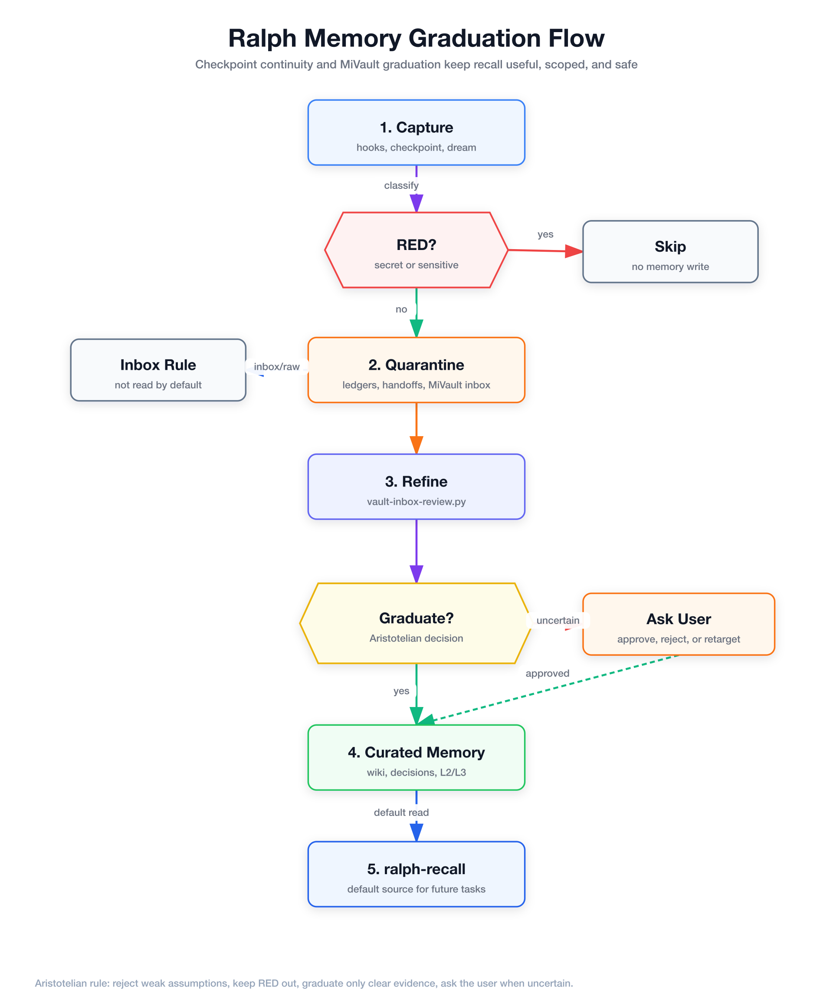

<p align="center">
  
</p>

<p align="center">
  
</p>

<h1 align="center">Codex Ralph Vault Loop</h1>

Codex Ralph Vault Loop is a Codex App and Codex CLI orchestration overlay for multi-agent engineering work. It keeps Codex as the owner of final decisions, uses external models only through MCP tools, verifies changes through gates and evals, and stores durable memory outside the repository.

Its operating contract is deliberately small:

```text
Codex main decides.
External models advise.
Gates verify.
Vault remembers.
```

The project ports the Ralph multi-agent workflow into Codex without copying private vault data and without configuring Z.ai or MiniMax as direct Codex `model_provider` backends. OpenAI remains the orchestrator. Z.ai, MiniMax, web readers, repo readers, and vision tools are used only through MCP boundaries after sensitivity checks.

##  What This Repo Provides

This repository is not an application template. It is a reusable operating layer for Codex sessions. It gives Codex durable instructions, project and global skills, subagent definitions, lifecycle hooks, security guards, memory tools, eval scripts, and global installation helpers.

The overlay supports several working modes:

| Capability          | What it does                                                                                                                                                                 |
| ------------------- | ---------------------------------------------------------------------------------------------------------------------------------------------------------------------------- |
| Orchestration       | Coordinates Codex main, subagents, MCP advisors, vault memory, gates, evals, and final handoff.                                                                              |
| Model routing       | Sends only eligible GREEN or sanitized YELLOW work to external MCP advisors; RED content stays local.                                                                        |
| Security boundaries | Detects secrets, credentials, wallet material, `.env` references, and sensitive markers before externalization or persistence.                                               |
| Vault memory        | Loads compact wakeup context and saves durable GREEN/YELLOW learnings outside the repo.                                                                                      |
| Quality gates       | Runs deterministic checks, scorecards, mutation guards, and eval suites before claiming completion.                                                                          |
| Global skills       | Installs reusable Codex workflows into `~/.agents/skills` and `~/.codex/skills` so they can be used from any repo or Codex App thread.                                       |
| Goal preparation    | Adds `ralph-objective-prep`, a Codex App standard skill for pre-execution intake before broad or risky native `/goal` work.                                                  |
| Subagents           | Provides narrow Codex agent definitions for coding, review, testing, security, evaluation, research, vision, and model counterpart work.                                     |
| Design workflow     | Adds `codex-design-studio`, a reusable Claude Design-like workflow for frontend/full-stack UI, decks, prototypes, style extraction, planning, implementation, and visual QA. |
| Codex maintenance   | Adds `keep-codex-fast`, a report-first skill for inspecting local Codex state, creating handoff reminders, backing up, and archive-only maintenance.                         |
| SFW command guard   | Guides package-manager network commands through `sfw` so install, fetch, and remote execution paths are protected without blocking safe retry workflows.                    |
| Repo-aware planning | Enforces `.ralph/plans` and implementation notes only when the active chat is associated with a real Git repository.                                                         |
| Productivity patterns | Documents safe `Done when`, native `/goal`, read-only exploration, skill/`@file`, worktree, notification, and report-only automation patterns without adopting `/resume`, `/compact`, `/permissions`, or `--yolo`. |

##  Current Status

Migration phases `00` through `20` are complete and checkpointed under [`docs/migration/checkpoints`](./docs/migration/checkpoints). The latest acceptance matrix is in [`PHASE_20.md`](./docs/migration/checkpoints/PHASE_20.md).

Current acceptance evidence:

- Repo doctor passes.
- `.codex/config.toml` parses.
- 18 project skills are present under `.agents/skills`.
- 12 Codex subagents parse under `.codex/agents`.
- Hooks run in dry-run mode.
- Vault scripts work with temporary `VAULT_DIR` and real MiVault read-only.
- Memory handoff works with temporary `RALPH_HOME`.
- Rolling checkpoints create compact in-progress continuity state and rehydrate only under budget, TTL, RED, and dedupe gates.
- Hook output contracts are enforced against the official Codex hook behavior: report-only `PostToolUse` and `Stop` paths leave stdout empty, blocking paths use supported JSON only, and installed global hooks are smoke-tested from `~/.codex/hooks`.
- MiVault inbox review and graduation are implemented with hash-only RED skips, Aristotelian decision objects, project-scoped auto-graduation, and user review for ambiguity/global rules.
- `reports/pre-global-audit/latest.md` can produce `PRE_GLOBAL_WORKTREE_AWARE_AUDIT_PASS` before global hook installation.
- Gates generate reports.
- Unit, integration, and eval suites pass.
- `ralph_coding_models.validate_coding_models` validates GLM-5.1, GLM-5-Turbo, and MiniMax-M2.7-highspeed.
- Package-manager network commands are protected by the PreTool guard with `sfw` guidance and simple protected retry suggestions.
- Plan and implementation-note enforcement is repo-aware, so non-repo chats are treated as general work and do not require `.ralph/plans` artifacts.
- RED content does not externalize and does not persist.

##  Architecture


The repo is organized around a few explicit surfaces:

| Surface                                      | Purpose                                                                                                                         |
| -------------------------------------------- | ------------------------------------------------------------------------------------------------------------------------------- |
| [`AGENTS.md`](./AGENTS.md)                   | Project instruction surface loaded by Codex App and Codex CLI.                                                                  |
| [`.codex/config.toml`](./.codex/config.toml) | Codex project config. OpenAI is the only orchestrator provider.                                                                 |
| [`.agents/skills`](./.agents/skills)         | Codex-native workflows for orchestration, routing, vault, gates, evals, research, design, objective preparation, and hardening. |
| [`.codex/agents`](./.codex/agents)           | Narrow TOML subagents such as coder, reviewer, tester, security, evaluator, vision analyst, and model counterparts.             |
| [`.codex/hooks`](./.codex/hooks)             | Session, prompt, tool, and stop lifecycle hooks with RED guards and local ledgers.                                              |
| [`scripts`](./scripts)                       | Deterministic setup, memory, vault, gate, eval, cost, and security utilities.                                                   |
| [`config/scorecards`](./config/scorecards)   | RASS v1 scorecards and hard gates.                                                                                              |
| `~/.ralph-codex`                             | Runtime memory, reports, ledgers, and handoffs.                                                                                 |
| `~/Documents/Obsidian/MiVault`               | Durable Obsidian memory outside the public repo.                                                                                |

Editable diagram sources and rendered assets live in [`docs/architecture/diagrams`](./docs/architecture/diagrams).

##  Routing And Safety


Routing is content-aware. Codex receives the task, loads global and project instructions, classifies sensitivity as GREEN, YELLOW, or RED, then chooses the smallest safe route. RED content stays local and is blocked from external MCP routing, vault persistence, and handoff storage. GREEN and sanitized YELLOW work can use local Codex execution, narrow Codex subagents, or MCP advisors. Codex main always integrates the result and makes the final decision.

The default MCP routing policy is:

| Need                                                 | Route                                                                   |
| ---------------------------------------------------- | ----------------------------------------------------------------------- |
| Fast logs, diffs, summaries, or test ideas           | `ralph_coding_models.minimax_agentic_fast` using MiniMax-M2.7-highspeed |
| Fast OpenClaw-like coding support                    | `ralph_coding_models.zai_coding_fast` using GLM-5-Turbo                 |
| Medium/high complexity counterpart review            | `ralph_coding_models.zai_coding_deep` using GLM-5.1                     |
| Current search, web reading, repo reading, or vision | Official Z.ai MCPs or configured aliases                                |
| Fast search or quick image understanding             | Official MiniMax MCP tools                                              |

Z.ai and MiniMax are never used for image, video, audio, voice, music, or visual generation. GPT Images 2 is the only approved visual generation route.

##  Memory, Gates, And Evals


The memory stack is intentionally outside the repo. Global hooks execute Ralph code from the stable checkout recorded in `~/.codex/hooks/.ralph-repo-root`, then derive the active project from the hook payload `cwd`/workdir. Runtime checkpoints, handoffs, ledgers, reports, and L2-L4 layers are scoped under `~/.ralph-codex/projects/<project_id>/`; L0/L1 remain global only when explicitly marked as global policy. RED is skipped by vault save, memory extraction, and stop handoff hooks.


Memory dream consolidation closes the runtime learning loop. `scripts/memory/dream.py` consolidates safe handoffs and ledgers into reviewable candidates, `--auto-update-state` writes the non-canonical `L4_dream_state` layer, and `wakeup.py` loads L4 on future session starts. The global `SessionStart` hook runs `scripts/memory/dream-scheduler.py --catch-up --target-time 11:30` before wakeup, so missed daily runs catch up the next time Codex starts. MiVault receives reviewable inbox digests through `--vault-inbox`; `scripts/vault/vault-inbox-review.py` audits those inbox candidates, and `scripts/vault/vault-graduate.py` can graduate only safe high-confidence project-scoped notes into curated `wiki` or `decisions`.




The detailed visual explainer is available at [`docs/architecture/ralph-memory-architecture-explainer.html`](./docs/architecture/ralph-memory-architecture-explainer.html). It is a self-contained repo-local page that explains the two-root model, project runtime layout, injection gates, MiVault graduation, and `ralph-recall` defaults.

The refinement model has three different trust zones:

| Zone | Current behavior | Recall behavior |
| --- | --- | --- |
| Runtime memory | Handoffs, ledgers, checkpoints, reports, and L2-L4 layers are produced per active project by hooks, `checkpoint.py`, and `dream.py`. | `wakeup.py` can load compact project layers plus fresh project rolling checkpoints; `ralph-recall.py` can find relevant safe runtime memory for the active project. |
| MiVault inbox/raw | `dream.py --vault-inbox` writes reviewable digests into project inbox as quarantine. `vault-inbox-review.py` evaluates inbox candidates in report-only mode by default. | Not read by default; only included with `ralph-recall.py --include-raw`. |
| Curated MiVault | `wiki`, `decisions`, `sessions`, and `handoffs` hold durable project knowledge. `vault-graduate.py` writes only safe, high-confidence, project-scoped candidates there. | Read by default when relevant to the project. |

Rolling checkpoints are compact operational state, not transcript replay. They store objective, phase, verified state, next action, blockers, relevant paths, validation status, and project metadata under `~/.ralph-codex/projects/<project_id>/checkpoints/`. `UserPromptSubmit` injects them only for continuation prompts such as `continua` or `resume` when the checkpoint belongs to the active project, session, workspace instance, and compatible branch; `SessionStart` applies the same gates before rehydrating; `Stop` compiles matching checkpoints into the project handoff.

Lifecycle hooks follow the official Codex hook contract at `https://developers.openai.com/codex/hooks`. Report-only hooks do not use stdout as a warning channel: `PostToolUse` and `Stop` report-only paths persist local JSONL/report evidence and leave stdout empty. Blocking paths emit only supported JSON, such as `{"decision":"block","reason":"..."}`; custom top-level evidence fields such as `files` must be folded into `reason` or persisted locally. Operational persistence hooks fail open on local runtime corruption, and rolling checkpoint writes are locked, atomic, and recover invalid `latest.json` by quarantining it before rebuilding state. Hook changes must be validated with the configured-hook contract tests, local hook smoke tests, global hook smoke tests, and global doctor before claiming completion.

Handoff rehydration is size-aware and identity-gated. `wakeup.py` first parses handoff metadata, validates project, session, workspace instance, TTL, classification, RED/redaction status, and per-session injection hash, then estimates the sanitized handoff body size. If it fits within the default `15%` reinjection budget, it is included without additional compaction; if it exceeds that budget, it is compacted deterministically. `RALPH_REINJECT_MAX_CONTEXT_RATIO` and `RALPH_REINJECT_HARD_WORD_LIMIT` can tune the budget, but the handoff path remains bounded by the overall wakeup context cap and never treats raw transcript or frontmatter as eligible injected context.

The MiVault graduation engine is intentionally Aristotelian: reject weak assumptions, keep RED out, preserve only irreducible useful facts, choose the smallest safe target, and ask the user when confidence, scope, or destination is ambiguous. Every decision includes machine-readable `aristotle` fields. RED candidates are hash-only audit events, duplicates are skipped, L1/global candidates ask the user, project decisions route to `decisions`, and project knowledge routes to `wiki`. Inbox remains non-canonical quarantine until report review or explicit graduation.

The quality spine is scriptable and repeatable:

| Tool                                                               | Role                                                                                           |
| ------------------------------------------------------------------ | ---------------------------------------------------------------------------------------------- |
| `scripts/memory/dream.py --dry-run`                                | Consolidates safe handoffs and ledgers into reviewable L1-L3 memory candidates.                |
| `scripts/memory/dream.py --auto-update-state`                      | Updates L4 dream state so future Codex wakeups can use high-confidence consolidated learnings. |
| `scripts/memory/dream.py --vault-inbox`                            | Writes a reviewable dream digest into the MiVault project inbox without canonical promotion.   |
| `scripts/memory/dream-scheduler.py --catch-up --target-time 11:30` | Runs the non-blocking daily catch-up policy used by the SessionStart hook.                     |
| `scripts/memory/checkpoint.py --doctor`                            | Validates rolling checkpoint JSON, render budget, injection state, and archive health.         |
| `scripts/vault/vault-inbox-review.py`                              | Produces report-only Aristotelian decisions for MiVault inbox candidates.                      |
| `scripts/vault/vault-graduate.py`                                  | Applies safe high-confidence project-scoped graduation into curated MiVault targets.           |
| `scripts/setup/pre-global-audit.py`                                | Generates the blocking `PRE_GLOBAL_WORKTREE_AWARE_AUDIT_PASS` report before global hook installation. |
| `scripts/setup/smoke-global-hooks.py`                              | Smoke-tests installed global hooks from `~/.codex/hooks` using a temporary runtime.            |
| `scripts/gates/run-gates.py --minimal`                             | Writes `latest.json` and `latest.md` under `GATES_REPORT_DIR` or `.ralph-codex/reports/gates`. |
| `scripts/evals/run_scorecard.py`                                   | Applies RASS v1 scorecards.                                                                    |
| `scripts/evals/research_eval.py`                                   | Validates research behavior in mock/offline mode.                                              |
| `scripts/evals/vision_eval.py`                                     | Validates vision-analysis behavior in mock/offline mode.                                       |
| `scripts/evals/coding_model_eval.py`                               | Validates MCP-oriented coding model behavior.                                                  |
| `scripts/evals/autoresearch_dry_run.py`                            | Runs the deterministic toy AutoResearch fixture and keep/discard decision.                     |

##  SFW And Repo-Aware Workflow Guards

The PreTool guard protects remote package-manager activity by requiring `sfw` for install, fetch, and remote execution commands such as `npm ci`, `pnpm install`, `pnpm dlx`, `npx`, `uvx`, `python3 -m pip install`, and `cargo install`. Simple commands receive a structured `suggested_command`, for example `sfw npm ci`, so Codex can retry safely instead of stopping at a generic block. Commands already prefixed with `sfw` pass, and local scripts such as `npm test`, `pnpm test`, and `cargo test` remain allowed by default unless they clearly fetch remote code.

Environment-prefixed or shell-complex package-manager commands are intentionally guidance-only rather than rewritten. For example, `FOO=bar npm ci` or `env -i npm ci` block with SFW guidance but no automatic `suggested_command`, because preserving shell and environment semantics requires human or model review before retrying.

Approved-plan implementation notes are repo-aware. Hooks first resolve whether the active `cwd`/workdir belongs to a real Git repository. Non-repo chats do not create `.ralph/plans`, do not create implementation notes, and do not block finalization for missing notes. Repo-backed work uses the repo-local `.ralph/plans` policy, and Codex worktrees resolve durable plans, notes, and the implementation index to the canonical stable repo root. Finalization blocks when the approved plan or notes exist only under an ephemeral worktree. The per-plan HTML remains the detailed source; `implementation-index.json` and `implementation-index.md` list implemented plans, linked notes, commits, PR references, and loose commits without duplicating the note body.

##  Global Skills And Workflows

The detailed global-skill documentation lives in [`docs/codex-global-skills.md`](./docs/codex-global-skills.md). The README keeps only the operator map so the file stays below the hook-enforced 350-line limit.

| Skill or workflow | Purpose |
| --- | --- |
| `codex-design-studio` | Frontend/full-stack UI, deck, prototype, style extraction, implementation, and visual QA workflow. |
| `keep-codex-fast` | Report-first local Codex App/CLI maintenance for sessions, logs, worktrees, config entries, backups, and archive-only cleanup. |
| `ralph-objective-prep` | Prep layer for broad or risky native `/goal` work; simple bounded goals stay on the native Goal path. |
| Codex productivity patterns | `Done when:` criteria, native `/goal`, explicit skills and `@file` references, report-only automations, and Ralph continuity rules. |

Safe operator shortcuts are documented in [`docs/codex-productivity-patterns.md`](./docs/codex-productivity-patterns.md). The Ralph continuity path remains `$handoff`, `.local-notes` where applicable, hook-driven wakeup/recall, scoped memory trace, and approved-plan implementation notes. `/resume`, `/compact`, `/permissions`, and `--yolo` are not adopted as Ralph workflows.

##  Global Installation

The global installer creates symlinks from this repo into the user's Codex and agent directories. It does not copy vault data, does not copy secrets, and does not edit `~/.codex/config.toml`. Conflicting global entries are backed up under `~/.ralph-codex/backups/global-install`.

Preview the changes:

```bash
bash scripts/setup/install-global.sh --dry-run
```

Install project skills globally:

```bash
bash scripts/setup/install-global.sh --install
```

Install or refresh only `ralph-objective-prep`:

```bash
bash scripts/setup/install-global.sh --install --skills ralph-objective-prep
```

Install skills plus Codex subagents:

```bash
bash scripts/setup/install-global.sh --install --with-agents
```

Check the global install:

```bash
bash scripts/setup/doctor-global.sh
```

Remove symlinks created by this repo:

```bash
bash scripts/setup/uninstall-global.sh --uninstall --with-agents
```

##  Quick Validation

Run the same checks used during acceptance:

```bash
bash scripts/setup/doctor.sh
python3 scripts/gates/run-gates.py --minimal
PYTEST_DISABLE_PLUGIN_AUTOLOAD=1 python3 -m pytest tests -q
python3 scripts/evals/coding_model_eval.py --mode mock
```

`run-gates.py` runs repository pytest through `scripts/gates/run-tests.py`, which
sets `PYTEST_DISABLE_PLUGIN_AUTOLOAD=1` for pytest subprocesses so global pytest
plugins cannot create false red gates. If the repo-local report directory is not
writable in a sandbox, set an explicit report directory:

```bash
GATES_REPORT_DIR=/private/tmp/codex-ralph-gates python3 scripts/gates/run-gates.py --minimal
```

For the focused Ralph memory recall, selection, injection, fallback, scope, trace,
and post-hook persistence checks:

```bash
bash scripts/validate-ralph-memory-flow.sh
```

Validate MCP coding models from a Codex session when the MCP is available:

```text
ralph_coding_models.validate_coding_models
```

Expected models:

- `glm-5.1`
- `glm-5-turbo`
- `MiniMax-M2.7-highspeed`

##  Repository Layout

```text
codex-ralph-vault-loop/
├── AGENTS.md
├── .agents/skills/
├── .codex/config.toml
├── .codex/hooks.json
├── .codex/agents/
├── .codex/hooks/
├── scripts/
│   ├── cost/
│   ├── evals/
│   ├── gates/
│   ├── memory/
│   ├── security/
│   ├── setup/
│   └── vault/
├── config/scorecards/
├── docs/
│   ├── architecture/
│   ├── assets/
│   ├── evals/
│   └── migration/
├── templates/
└── tests/
```

##  Key Documentation

| Document                                                                | Purpose                                          |
| ----------------------------------------------------------------------- | ------------------------------------------------ |
| [Architecture overview](./docs/architecture/overview.md)                | System-level architecture and responsibilities.  |
| [MCP model router](./docs/architecture/mcp-model-router.md)             | External model routing policy and constraints.   |
| [Memory stack](./docs/architecture/memory-stack.md)                     | Worktree-aware wakeup, handoff, vault, graduation, and recall model. |
| [Codex productivity patterns](./docs/codex-productivity-patterns.md)     | Safe prompt, goal, worktree, continuity, notification, and report-only automation patterns. |
| [Memory visual explainer](./docs/architecture/ralph-memory-architecture-explainer.html) | Browser-readable visual guide for the Ralph memory architecture. |
| [Hooks](./docs/architecture/hooks.md)                                   | Codex lifecycle hooks and safety behavior.       |
| [Subagents](./docs/architecture/subagents.md)                           | Codex subagent definitions and roles.            |
| [Evaluation spine](./docs/architecture/evaluation-spine.md)             | Gates, evals, scorecards, and acceptance checks. |
| [Threat model](./docs/architecture/threat-model.md)                     | RED/YELLOW/GREEN sensitivity boundaries.         |
| [Migration phase plan](./docs/migration/phase-plan.md)                  | Phase-by-phase migration structure.              |
| [Final acceptance checkpoint](./docs/migration/checkpoints/PHASE_20.md) | Latest full acceptance matrix.                   |

##  Source Lineage

This is a Codex-native adaptation of [`multi-agent-ralph-loop`](https://github.com/alfredolopez80/multi-agent-ralph-loop). The Claude runtime primitives were replaced with Codex App and Codex CLI primitives:

| Claude-side concept        | Codex-side implementation                     |
| -------------------------- | --------------------------------------------- |
| `CLAUDE.md`                | `AGENTS.md`                                   |
| `.claude/skills`           | `.agents/skills` and optional global symlinks |
| Claude hooks               | `.codex/hooks` and `.codex/hooks.json`        |
| Agent Teams                | `.codex/agents/*.toml`                        |
| Direct secondary providers | MCP tools only                                |
| Vault L3                   | MiVault / Obsidian                            |
| AutoResearch               | Scorecard-driven dry-run/eval spine           |

The `ralph-objective-prep` addition also takes inspiration from [`tolibear/goalbuddy`](https://github.com/tolibear/goalbuddy). GoalBuddy contributed the prep-before-execution pattern, role-shaped Scout/Judge/Worker task vocabulary, durable board concepts, and receipt-based completion discipline. The adaptation here complements native `/goal`, uses Codex App standard Goal/App Server surfaces, stores prepared boards under `~/.ralph-codex/goals` by default, and avoids GoalBuddy runtime dependencies.

## License

MIT.
