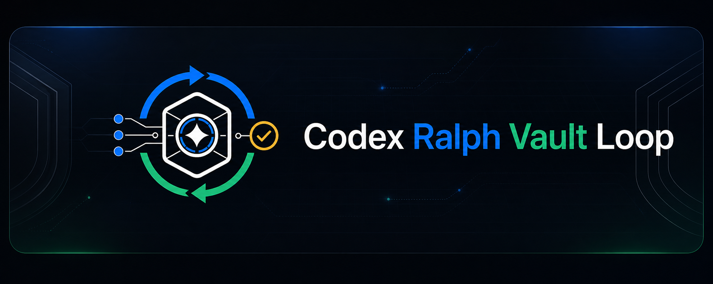
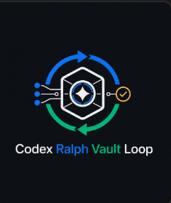
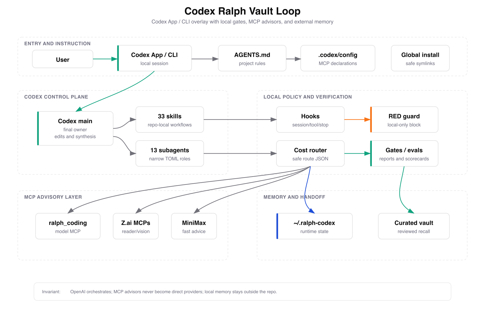
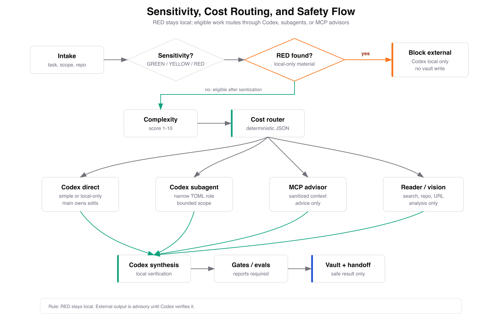
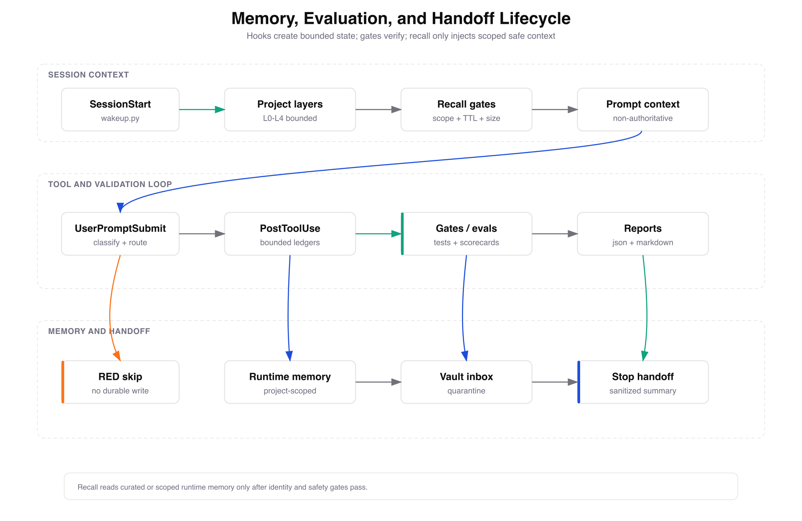
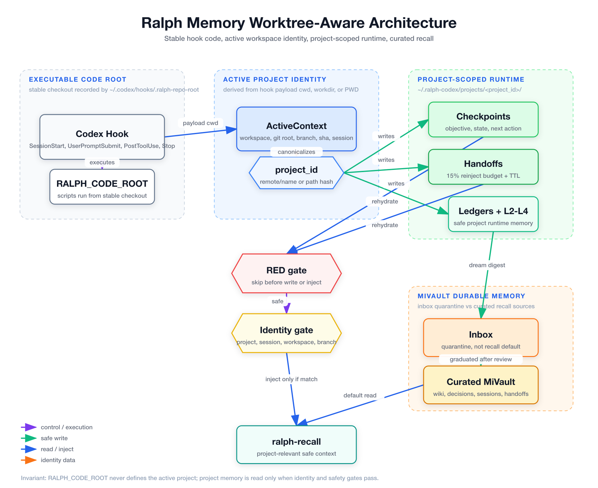
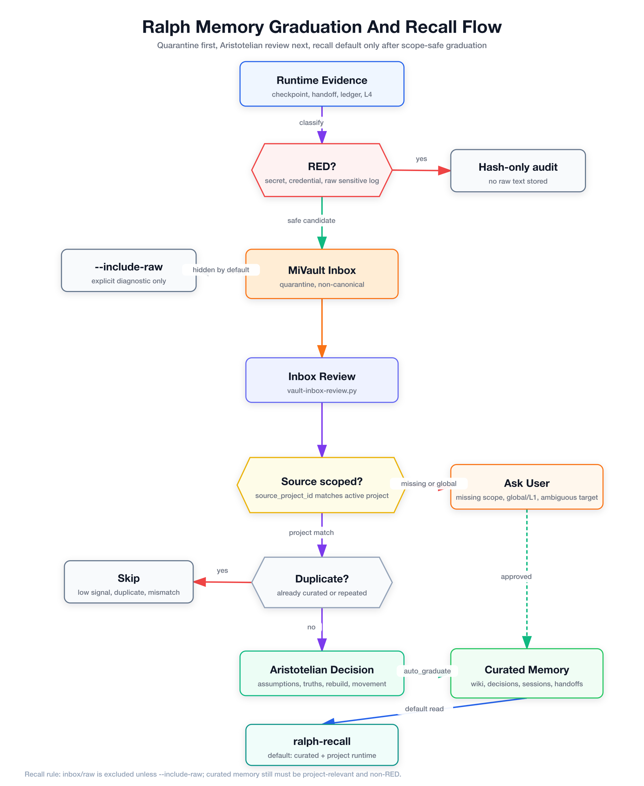

<p align="center">
  
</p>

<p align="center">
  
</p>

<h1 align="center">Codex Ralph Vault Loop</h1>

Codex Ralph Vault Loop is a Codex App and Codex CLI operating layer for
multi-agent engineering work. It keeps Codex main responsible for decisions and
edits, sends only eligible context to MCP advisors, verifies work through gates,
and stores durable memory outside the public repository.

```text
Codex main decides.
External models advise.
Gates verify.
Vault remembers.
```

This is not an app template. It is a reusable control plane for Codex sessions:
instructions, skills, subagents, hooks, model-routing helpers, security guards,
evals, memory tools, and global installation scripts.

##  What It Provides

| Surface                                      | Purpose                                                                                                   |
| -------------------------------------------- | --------------------------------------------------------------------------------------------------------- |
| [`AGENTS.md`](./AGENTS.md)                   | Canonical project instructions for Codex App and Codex CLI.                                               |
| [`.codex/config.toml`](./.codex/config.toml) | Project Codex defaults and MCP server declarations.                                                       |
| [`.agents/skills`](./.agents/skills)         | 33 repo-local skills for orchestration, review, gates, memory, research, design, and hardening.           |
| [`.codex/agents`](./.codex/agents)           | 13 narrow subagent definitions for coding, review, testing, security, eval, vision, and counterpart work. |
| [`.codex/hooks`](./.codex/hooks)             | Session, prompt, tool, and stop hooks with local safety checks.                                           |
| [`scripts`](./scripts)                       | Deterministic setup, memory, vault, gate, eval, cost, and security utilities.                             |
| [`config/scorecards`](./config/scorecards)   | RASS v1 scorecards and hard gates.                                                                        |
| [`docs`](./docs)                             | Architecture, migration, hook, memory, eval, and workflow documentation.                                  |
| [`plugins`](./plugins)                       | Guidance-only plugin skill packages that can be installed globally.                                       |

The local runtime writes memory, ledgers, reports, and handoffs under
`~/.ralph-codex`. Curated vault knowledge stays outside the repository.

##  Repository Layout

```text
codex-ralph-vault-loop/
├── AGENTS.md
├── CLAUDE.md
├── README.md
├── SECURITY.md
├── .agents/
│   └── skills/
├── .codex/
│   ├── agents/
│   ├── config.toml
│   ├── hooks/
│   └── hooks.json
├── .claude/
│   ├── agents/
│   └── rules/
├── config/
│   └── scorecards/
├── docs/
│   ├── architecture/
│   ├── assets/
│   ├── diagrams/
│   ├── evals/
│   └── migration/
├── plugins/
├── scripts/
│   ├── autoresearch/
│   ├── cost/
│   ├── evals/
│   ├── gates/
│   ├── maintenance/
│   ├── memory/
│   ├── model-router/
│   ├── plans/
│   ├── security/
│   ├── setup/
│   └── vault/
├── skills/
├── templates/
└── tests/
```

##  Architecture



The overlay has five operating lanes:

| Lane         | Responsibility                                                               |
| ------------ | ---------------------------------------------------------------------------- |
| Entry        | User request, Codex App or CLI, project instructions, and repo config.       |
| Codex core   | Codex main owns edits, synthesis, final decisions, and user-visible output.  |
| Local policy | Hooks, RED guard, route decision, cost router, gates, and evals.             |
| MCP advisors | Z.ai, MiniMax, and other MCP tools advise only after sensitivity checks.     |
| Memory       | Project-scoped runtime state, handoffs, and curated recall outside the repo. |

OpenAI remains the orchestrator. Z.ai and MiniMax are not configured as direct
Codex providers; they enter only through MCP boundaries. Z.ai and MiniMax are
analysis-only for visual work. GPT Images 2 is the approved image-generation
route.

##  Routing And Safety



Routing starts with sensitivity and scope. RED content stays local and is
blocked from MCP routing, vault persistence, and public handoffs. GREEN and
sanitized YELLOW work can use local Codex execution, Codex subagents, or MCP
advisors. Codex main integrates every advisory result and verifies locally.

Default route map:

| Need                                                          | Route                                   |
| ------------------------------------------------------------- | --------------------------------------- |
| Trivial local work                                            | Codex local                             |
| Fast logs, diffs, summaries, or test ideas                    | MiniMax MCP fast lane                   |
| Fast bounded coding support                                   | Z.ai fast MCP lane or MiniMax fast lane |
| Debugging, architecture, migrations, or claim review          | Z.ai deep MCP lane, after sanitization  |
| Current search, URL reading, repo reading, or vision analysis | Official MCP reader/search/vision tools |
| RED or unclear sensitivity                                    | Local only                              |

The repo includes a security detector in
[`scripts/security/sensitive_content.py`](./scripts/security/sensitive_content.py),
Semgrep rules in [`.semgrep.yml`](./.semgrep.yml), and the public security
policy in [`SECURITY.md`](./SECURITY.md).

##  Memory, Gates, And Evals



Global hooks resolve Ralph code from the stable checkout recorded by the global
hook layer, then derive the active project from the hook payload. That split
keeps worktree identity separate from executable hook code.

Memory has three trust zones:

| Zone                     | Behavior                                                                  |
| ------------------------ | ------------------------------------------------------------------------- |
| Runtime memory           | Project-scoped checkpoints, handoffs, ledgers, reports, and L2-L4 layers. |
| Inbox/raw vault material | Quarantine. Not read by default.                                          |
| Curated vault memory     | Reviewed project knowledge that recall can use when scope matches.        |





The detailed visual explainer is
[`docs/architecture/ralph-memory-architecture-explainer.html`](./docs/architecture/ralph-memory-architecture-explainer.html).

##  Content And Diagram Quality

Public prose should read like documentation written by a maintainer, not a
generated brochure. Use `stop-slop` and `deslop` for README, docs, skill text,
release notes, articles, and future blog-style content. Use
`content-research-writer` when a claim needs sourcing, and keep citations close
to the claim they support.

For visual assets and article imagery:

| Check       | Standard                                                                                                            |
| ----------- | ------------------------------------------------------------------------------------------------------------------- |
| Brand       | Use the existing logo, banner, and heading icon style under `docs/assets/branding`.                                 |
| Diagrams    | Keep editable JSON beside SVG and PNG under `docs/architecture/diagrams` or `docs/diagrams`.                        |
| Generation  | Use `fireworks-tech-graph` for technical diagrams and validate SVG before exporting PNG.                            |
| Translation | Keep public docs in one clear language per file. Review translated docs for terminology, not literal word matching. |
| Scope       | Do not publish private local paths, raw memory, personal notes, or unrelated organization names.                    |

There are no blog posts or locale folders in this repo today. The content rules
above apply to new public articles, plugin pages, translated docs, and future
website material created from this repository.

##  Global Installation

The installer creates symlinks from this checkout into the user's Codex and
agent directories. It does not copy vault data and does not edit the user's
global Codex config.

Preview the changes:

```bash
bash scripts/setup/install-global.sh --dry-run
```

Install project skills globally:

```bash
bash scripts/setup/install-global.sh --install
```

Install skills plus Codex subagents:

```bash
bash scripts/setup/install-global.sh --install --with-agents
```

Check the global install:

```bash
bash scripts/setup/doctor-global.sh
```

Remove symlinks created by this repo:

```bash
bash scripts/setup/uninstall-global.sh --uninstall --with-agents
```

##  Validation

Run the core checks before publishing changes:

```bash
bash scripts/setup/doctor.sh
python3 scripts/gates/run-gates.py --minimal
PYTEST_DISABLE_PLUGIN_AUTOLOAD=1 python3 -m pytest tests -q
python3 scripts/evals/coding_model_eval.py --mode mock
```

Run focused security checks before publishing or merging:

```bash
gitleaks detect --no-banner --redact
semgrep --config .semgrep.yml .
python3 scripts/gates/run-security.py --mode standard
```

If the repo-local report directory is not writable in a sandbox, set an explicit
report directory:

```bash
GATES_REPORT_DIR=/private/tmp/codex-ralph-gates python3 scripts/gates/run-gates.py --minimal
```

For focused memory recall, selection, injection, fallback, trace, and post-hook
persistence checks:

```bash
bash scripts/validate-ralph-memory-flow.sh
```

##  Documentation Map

| Document                                                                | Purpose                                                              |
| ----------------------------------------------------------------------- | -------------------------------------------------------------------- |
| [Architecture overview](./docs/architecture/overview.md)                | System-level architecture and responsibilities.                      |
| [MCP model router](./docs/architecture/mcp-model-router.md)             | External model routing policy and constraints.                       |
| [Memory stack](./docs/architecture/memory-stack.md)                     | Worktree-aware wakeup, handoff, vault, graduation, and recall model. |
| [Hooks](./docs/architecture/hooks.md)                                   | Codex lifecycle hooks and safety behavior.                           |
| [Subagents](./docs/architecture/subagents.md)                           | Codex subagent definitions and roles.                                |
| [Evaluation spine](./docs/architecture/evaluation-spine.md)             | Gates, evals, scorecards, and acceptance checks.                     |
| [Threat model](./docs/architecture/threat-model.md)                     | Repository threat model and mitigations.                             |
| [Global skills](./docs/codex-global-skills.md)                          | Installable skills and workflow guidance.                            |
| [Productivity patterns](./docs/codex-productivity-patterns.md)          | Safe prompt, goal, worktree, continuity, and automation patterns.    |
| [Migration phase plan](./docs/migration/phase-plan.md)                  | Phase-by-phase migration structure.                                  |
| [Final acceptance checkpoint](./docs/migration/checkpoints/PHASE_21.md) | Latest acceptance checkpoint.                                        |

##  Source Lineage

This repository is a Codex-native adaptation of
[`multi-agent-ralph-loop`](https://github.com/alfredolopez80/multi-agent-ralph-loop).
The Claude-side runtime ideas were mapped into Codex App and Codex CLI
surfaces:

| Claude-side concept        | Codex-side implementation                     |
| -------------------------- | --------------------------------------------- |
| `CLAUDE.md`                | `AGENTS.md`                                   |
| `.claude/skills`           | `.agents/skills` and optional global symlinks |
| Claude hooks               | `.codex/hooks` and `.codex/hooks.json`        |
| Agent Teams                | `.codex/agents/*.toml`                        |
| Direct secondary providers | MCP tools only                                |
| Vault L3                   | External curated vault memory                 |
| AutoResearch               | Scorecard-driven dry-run and eval spine       |

The `ralph-objective-prep` skill also takes inspiration from
[`tolibear/goalbuddy`](https://github.com/tolibear/goalbuddy). This adaptation
keeps native `/goal`, stores prepared local boards under the Ralph runtime, and
does not depend on GoalBuddy at runtime.

## License

MIT.
