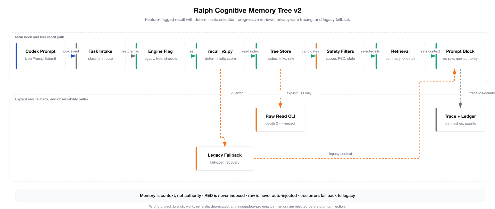

<p align="center">
  
</p>

<p align="center">
  
</p>

<h1 align="center">Codex Ralph Vault Loop</h1>

Codex Ralph Vault Loop is a safety and memory layer for serious Codex App and
Codex CLI work. It gives Codex a reusable operating system for multi-agent
engineering: clear instructions, scoped skills, review subagents, lifecycle
hooks, security gates, model-routing policy, and durable memory that stays
outside the public repo.

```text
Codex main decides.
External models advise.
Gates verify.
Vault remembers.
```

Use it when a single prompt is no longer enough: you need repeatable reviews,
bounded external-model help, RED/YELLOW/GREEN sensitivity rules, and a way for
Codex sessions to remember verified work without leaking private context.

##  Who It Is For

| You are...                         | This repo helps you...                                                                  |
| ---------------------------------- | --------------------------------------------------------------------------------------- |
| Building with Codex every day      | Keep instructions, hooks, skills, and review agents consistent across sessions.         |
| Reviewing sensitive local work     | Block RED content from MCP tools, public handoffs, and durable memory.                  |
| Using multiple model/tool advisors | Route sanitized work to MCP advisors while keeping Codex main responsible for the call. |
| Maintaining open source workflows  | Publish docs, diagrams, gates, and security policy without private path leakage.        |

What you get from a fresh checkout:

- A Codex-native instruction surface in [`AGENTS.md`](./AGENTS.md).
- 33 repo-local skills and 13 subagents wired for review, security, memory,
  research, design, testing, and eval work.
- Hook, gate, security, memory, vault, and model-router scripts that can be run
  locally before installing anything globally.
- Ralph Cognitive Memory Tree v2 for experimental deterministic recall,
  benchmarked retrieval, shadow comparison, and feature-flagged hook injection.
- Editable architecture diagrams with PNG/SVG outputs for public documentation.

##  Quick Start

Run the local doctor first:

```bash
bash scripts/setup/doctor.sh
```

Preview the global install:

```bash
bash scripts/setup/install-global.sh --dry-run
```

Install project skills globally:

```bash
bash scripts/setup/install-global.sh --install
```

Add Codex subagents too:

```bash
bash scripts/setup/install-global.sh --install --with-agents
```

Validate the install:

```bash
bash scripts/setup/doctor-global.sh
```

To remove symlinks created by this repo:

```bash
bash scripts/setup/uninstall-global.sh --uninstall --with-agents
```

The installer creates symlinks into the user's Codex and agent directories. It
does not copy vault data and does not edit the user's global Codex config.

##  What It Provides

| Surface                                      | Purpose                                                                                                   |
| -------------------------------------------- | --------------------------------------------------------------------------------------------------------- |
| [`AGENTS.md`](./AGENTS.md)                   | Canonical project instructions for Codex App and Codex CLI.                                               |
| [`.codex/config.toml`](./.codex/config.toml) | Project Codex defaults and MCP server declarations.                                                       |
| [`.agents/skills`](./.agents/skills)         | 33 repo-local skills for orchestration, review, gates, memory, research, design, and hardening.           |
| [`.codex/agents`](./.codex/agents)           | 13 narrow subagent definitions for coding, review, testing, security, eval, vision, and counterpart work. |
| [`.codex/hooks`](./.codex/hooks)             | Session, prompt, tool, and stop hooks with local safety checks.                                           |
| [`scripts`](./scripts)                       | Deterministic setup, memory, vault, gate, eval, cost, and security utilities.                             |
| [`config/scorecards`](./config/scorecards)   | RASS v1 scorecards and hard gates.                                                                        |
| [`docs`](./docs)                             | Architecture, migration, hook, memory, eval, and workflow documentation.                                  |
| [`plugins`](./plugins)                       | Guidance-only plugin skill packages that can be installed globally.                                       |

The local runtime writes memory, ledgers, reports, and handoffs under
`~/.ralph-codex`. Curated vault knowledge stays outside the repository.

##  Repository Layout

```text
codex-ralph-vault-loop/
├── AGENTS.md
├── CLAUDE.md
├── README.md
├── SECURITY.md
├── .agents/
│   └── skills/
├── .codex/
│   ├── agents/
│   ├── config.toml
│   ├── hooks/
│   └── hooks.json
├── .claude/
│   ├── agents/
│   └── rules/
├── config/
│   └── scorecards/
├── docs/
│   ├── architecture/
│   ├── assets/
│   ├── diagrams/
│   ├── evals/
│   └── migration/
├── plugins/
├── scripts/
│   ├── autoresearch/
│   ├── cost/
│   ├── evals/
│   ├── gates/
│   ├── maintenance/
│   ├── memory/
│   ├── model-router/
│   ├── plans/
│   ├── security/
│   ├── setup/
│   └── vault/
├── skills/
├── templates/
└── tests/
```

##  Architecture


The overlay has five operating lanes:

| Lane         | Responsibility                                                               |
| ------------ | ---------------------------------------------------------------------------- |
| Entry        | User request, Codex App or CLI, project instructions, and repo config.       |
| Codex core   | Codex main owns edits, synthesis, final decisions, and user-visible output.  |
| Local policy | Hooks, RED guard, route decision, cost router, gates, and evals.             |
| MCP advisors | Z.ai, MiniMax, and other MCP tools advise only after sensitivity checks.     |
| Memory       | Project-scoped runtime state, handoffs, and curated recall outside the repo. |

OpenAI remains the orchestrator. Z.ai and MiniMax are not configured as direct
Codex providers; they enter only through MCP boundaries. Z.ai and MiniMax are
analysis-only for visual work. GPT Images 2 is the approved image-generation
route.

##  Routing And Safety


Routing starts with sensitivity and scope. RED content stays local and is
blocked from MCP routing, vault persistence, and public handoffs. GREEN and
sanitized YELLOW work can use local Codex execution, Codex subagents, or MCP
advisors. Codex main integrates every advisory result and verifies locally.

Default route map:

| Need                                                          | Route                                   |
| ------------------------------------------------------------- | --------------------------------------- |
| Trivial local work                                            | Codex local                             |
| Fast logs, diffs, summaries, or test ideas                    | MiniMax MCP fast lane                   |
| Fast bounded coding support                                   | Z.ai fast MCP lane or MiniMax fast lane |
| Debugging, architecture, migrations, or claim review          | Z.ai deep MCP lane, after sanitization  |
| Current search, URL reading, repo reading, or vision analysis | Official MCP reader/search/vision tools |
| RED or unclear sensitivity                                    | Local only                              |

The repo includes a security detector in
[`scripts/security/sensitive_content.py`](./scripts/security/sensitive_content.py),
Semgrep rules in [`.semgrep.yml`](./.semgrep.yml), and the public security
policy in [`SECURITY.md`](./SECURITY.md).

##  Memory, Gates, And Evals


Global hooks resolve Ralph code from the stable checkout recorded by the global
hook layer, then derive the active project from the hook payload. That split
keeps worktree identity separate from executable hook code.

Memory has three trust zones:

| Zone                     | Behavior                                                                  |
| ------------------------ | ------------------------------------------------------------------------- |
| Runtime memory           | Project-scoped checkpoints, handoffs, ledgers, reports, and L2-L4 layers. |
| Inbox/raw vault material | Quarantine. Not read by default.                                          |
| Curated vault memory     | Reviewed project knowledge that recall can use when scope matches.        |



Memory Tree v2 sits beside legacy recall. It stores sanitized `MemoryNode` JSON
under `~/.ralph-codex/projects/<project_id>/memory_tree/`, scores recall
deterministically, and injects only delimited non-authoritative context. Raw
memory stays behind the explicit reader command with `--depth 2 --redact`; hook
output and default recall never include raw bodies.

The v2 path rejects RED, incomplete provenance, wrong project, wrong branch,
wrong worktree, deprecated memory, conflicts, and unsafe promotion candidates.
Shadow mode with `RALPH_MEMORY_TREE_SHADOW=1` compares v2 with legacy without
changing final prompt content. If v2 errors in hook flow, the system falls open
to legacy and records the fallback in `MEMORY_TRACE_JSON`.


The detailed visual explainer is
[`docs/architecture/ralph-memory-architecture-explainer.html`](./docs/architecture/ralph-memory-architecture-explainer.html).

##  Content And Diagram Quality

Public prose should read like documentation written by a maintainer, not a
generated brochure. Use `stop-slop` and `deslop` for README, docs, skill text,
release notes, articles, and future blog-style content. Use
`content-research-writer` when a claim needs sourcing, and keep citations close
to the claim they support.

For visual assets and article imagery:

| Check       | Standard                                                                                                            |
| ----------- | ------------------------------------------------------------------------------------------------------------------- |
| Brand       | Use the existing logo, banner, and heading icon style under `docs/assets/branding`.                                 |
| Diagrams    | Keep editable JSON beside SVG and PNG under `docs/architecture/diagrams` or `docs/diagrams`.                        |
| Generation  | Use `fireworks-tech-graph` for technical diagrams and validate SVG before exporting PNG.                            |
| Translation | Keep public docs in one clear language per file. Review translated docs for terminology, not literal word matching. |
| Scope       | Do not publish private local paths, raw memory, personal notes, or unrelated organization names.                    |

There are no blog posts or locale folders in this repo today. The content rules
above apply to new public articles, plugin pages, translated docs, and future
website material created from this repository.

##  Validation

Run the core checks before publishing changes:

```bash
bash scripts/setup/doctor.sh
python3 scripts/gates/run-gates.py --minimal
PYTEST_DISABLE_PLUGIN_AUTOLOAD=1 python3 -m pytest tests -q
python3 scripts/evals/coding_model_eval.py --mode mock
```

Run focused security checks before publishing or merging:

```bash
gitleaks detect --no-banner --redact
semgrep --config .semgrep.yml .
python3 scripts/gates/run-security.py --mode standard
```

If the repo-local report directory is not writable in a sandbox, set an explicit
report directory:

```bash
GATES_REPORT_DIR=/private/tmp/codex-ralph-gates python3 scripts/gates/run-gates.py --minimal
```

For focused memory recall, selection, injection, fallback, trace, and post-hook
persistence checks:

```bash
bash scripts/validate-ralph-memory-flow.sh
```

For Memory Tree v2 hook flow, deterministic benchmark, and scorecard:

```bash
RALPH_MEMORY_RECALL_ENGINE=tree PYTEST_DISABLE_PLUGIN_AUTOLOAD=1 python3 -m pytest tests/integration/test_memory_tree_hook_flow_e2e.py tests/unit/test_memory_recall_v2.py -q
python3 scripts/evals/memory_tree_benchmark.py --fixture tests/evals/fixtures/memory_tree_retrieval --output /tmp/ralph-memory-tree-benchmark.json
python3 scripts/evals/run_scorecard.py --scorecard config/scorecards/memory_retrieval_v2.yaml --input /tmp/ralph-memory-tree-benchmark.json
```

##  Documentation Map

| Document                                                                        | Purpose                                                                                                                |
| ------------------------------------------------------------------------------- | ---------------------------------------------------------------------------------------------------------------------- |
| [Architecture overview](./docs/architecture/overview.md)                        | System-level architecture and responsibilities.                                                                        |
| [MCP model router](./docs/architecture/mcp-model-router.md)                     | External model routing policy and constraints.                                                                         |
| [Memory stack](./docs/architecture/memory-stack.md)                             | Worktree-aware wakeup, handoff, vault, graduation, and recall model.                                                   |
| [Memory Tree v2](./docs/architecture/memory-tree-v2.md)                         | Experimental deterministic recall tree, node schema, progressive retrieval, shadow mode, migration, and rollback.      |
| [Memory Tree v2 operator guide](./docs/guides/memory-tree-v2-operator-guide.md) | Commands for enabling, disabling, compacting, recalling, benchmarking, observing, consolidating, and promoting memory. |
| [Hooks](./docs/architecture/hooks.md)                                           | Codex lifecycle hooks and safety behavior.                                                                             |
| [Subagents](./docs/architecture/subagents.md)                                   | Codex subagent definitions and roles.                                                                                  |
| [Evaluation spine](./docs/architecture/evaluation-spine.md)                     | Gates, evals, scorecards, and acceptance checks.                                                                       |
| [Threat model](./docs/architecture/threat-model.md)                             | Repository threat model and mitigations.                                                                               |
| [Global skills](./docs/codex-global-skills.md)                                  | Installable skills and workflow guidance.                                                                              |
| [Productivity patterns](./docs/codex-productivity-patterns.md)                  | Safe prompt, goal, worktree, continuity, and automation patterns.                                                      |
| [Migration phase plan](./docs/migration/phase-plan.md)                          | Phase-by-phase migration structure.                                                                                    |
| [Final acceptance checkpoint](./docs/migration/checkpoints/PHASE_21.md)         | Latest acceptance checkpoint.                                                                                          |

##  Source Lineage

This repository is a Codex-native adaptation of
[`multi-agent-ralph-loop`](https://github.com/alfredolopez80/multi-agent-ralph-loop).
The Claude-side runtime ideas were mapped into Codex App and Codex CLI
surfaces:

| Claude-side concept        | Codex-side implementation                     |
| -------------------------- | --------------------------------------------- |
| `CLAUDE.md`                | `AGENTS.md`                                   |
| `.claude/skills`           | `.agents/skills` and optional global symlinks |
| Claude hooks               | `.codex/hooks` and `.codex/hooks.json`        |
| Agent Teams                | `.codex/agents/*.toml`                        |
| Direct secondary providers | MCP tools only                                |
| Vault L3                   | External curated vault memory                 |
| AutoResearch               | Scorecard-driven dry-run and eval spine       |

The `ralph-objective-prep` skill also takes inspiration from
[`tolibear/goalbuddy`](https://github.com/tolibear/goalbuddy). This adaptation
keeps native `/goal`, stores prepared local boards under the Ralph runtime, and
does not depend on GoalBuddy at runtime.

## License

MIT.
